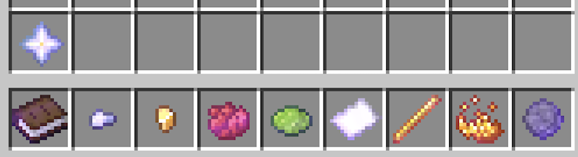
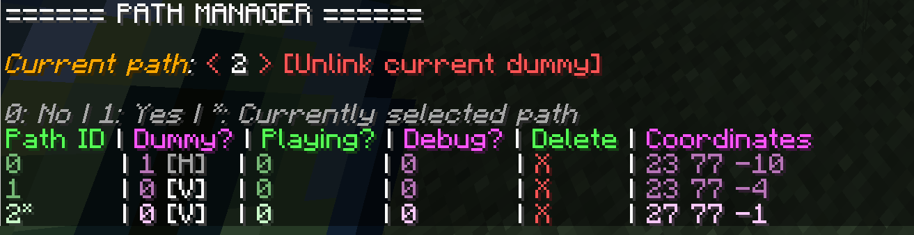

*Guide last updated on 14.10.2024*

# Getting started

## Basic tools & UI

Once you have installed the datapack, run the following command to set up the necessary tools. **MAKE SURE THAT YOU HAVE AT LEAST 10 EMPTY SLOTS IN YOUR INVENTORY**.

```
/function anim_movement:give_controls
```

After running this command, you'll notice two things.

**Firstly**, you will see a **scoreboard** to the right of your screen like so:


This is where you can see the list of admins and the **ID of the current path** that each admin has currently selected. In this image, I have currently selected **path number 0**. Selecting a particular path allows you to use *tools* (explained below) to add, modify, delete, play and pause the selected path, as well as assign/unlink mobs to/from the path.

**Secondly**, you will have been given some extra items, or **tools**, as shown below:



You can hover over each of these tools to see their names. **To use a tool**, hold a tool in your primary slot and **press right click**. You will see that holding a tool automatically puts an eye of ender in your secondary slot. The eye of ender is there to detect right click events.

The table below summarises their roles.

| Tool name | Description | Item type |
| - | - | - |
| **Open path manager** | Open the path manager UI explained in the section below. | Book |
| **Select previous path** | Reduces the current selected path ID by 1. | Iron nugget |
| **Select next path** | Increases the current selected path ID by 1. | Gold nugget |
| **Start/stop recording** | Start or stop recording the current selected path. Armor stands showing the recorded path will be temporarily visible during recording. | Red dye |
| **Start/stop playing** | Start or stop playing the current selected path. | Lime dye |
| **Toggle labels & armor stands visibility** | Show or hide the armor stands recording the path and the labels above the path and corresponding dummy. | Paper |
| **Select dummy** | Select a dummy mob for the current path by using the tool while standing close (&lt; 3 blocks distance) to the target. | Blaze rod |
| **Unlink dummy** | Unlink the dummy from the current path. | Blaze powder |
| **Delete current path** | Delete the current path and unlink the associated dummy. | Firework star |
| **Teleport to current path** | Teleport to the current path. | Nether star |

## Path manager UI

The path manager UI makes managing multiple paths easier by summarising their status and providing an easy way to perform related tasks. To view the path manager, **use the Open path manager tool**. You will then see something like the following appear in your chat.



**On the top row**, the path manager shows you **the ID of the currently selected path**. You can **click on the red brackets** to select the previous/next paths easily.

Next to the path navigator is a button for **unlinking the current dummy**.

The table summarises **the status of the registered paths**. The current path is highlighted in a brighter colour, and is also indicated by an asterisk (\*) next to the path ID. You can hover your cursor above the column headings to see what each column stands for. For the *Dummy?*, *Playing?*, and *Debug?* columns, a value of 1 indicates 'Yes/Present/Visible' while 0 denotes 'No/Absent/Hidden'.

You can also click on the values within the table to perform certain actions. The functionalities provided by each of the columns are summarised below.

| Column | Description | Functionality when clicked |
| - | - | - |
| **Path ID** | Path ID | Quickly selects the path |
| **Dummy?** (Number) | Whether the path has an assigned dummy | Gives the glowing effect to the dummy for 5 seconds |
| **Dummy?** (V/H) | Whether the dummy is visible (V) or hidden (H) | Show/hide dummy |
| **Playing?** | Whether the path is currently playing or not | Plays/pauses the path |
| **Debug?** | Whether the armor stands & labels are visible | Toggles armor stand & label visibility |
| **Delete** | | Deletes the path |
| **Coordinates** | The X, Y, and Z coordinates of the path marker | Teleports player to the path marker |

## Example workflow

An example workflow using these tools may be as follows:

1. Use the **Next/Previous path tools** or the **path manager UI** to navigate to path number 0
2. Use the **Start/stop record tool** to record the player's movement
3. Use the **Start/stop record tool** again to override the recorded movement if needed
4. Use the **Select dummy tool** to select the desired dummy mob/entity
5. Use the **Start/stop playing tool** to start the animation
6. Use the **Next/Previous path tools** or the **path manager UI** to switch to a different path and start another recording
7. Use the **path manager UI** to play/pause paths whenever needed

## Notes

### Please note that this datapack hasn't been tested on a multiplayer server yet!

The datapack should function as intended on a multiplayer server, but some instabilities are expected. In a multiplayer setting, **all admins (i.e. people who have obtained the tools via the relevant command) will be sharing the same set of paths**. Especially, more than one person trying to record the same path at the same time will likely lead to issues, so please make sure to coordinate carefully to prevent this from happening.

## Troubleshooting

For troubleshooting matters, please see [here](TROUBLESHOOTING.md)